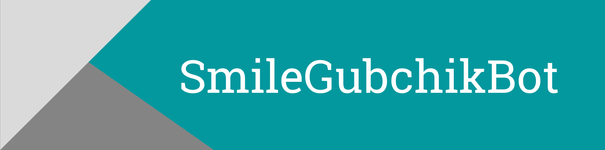
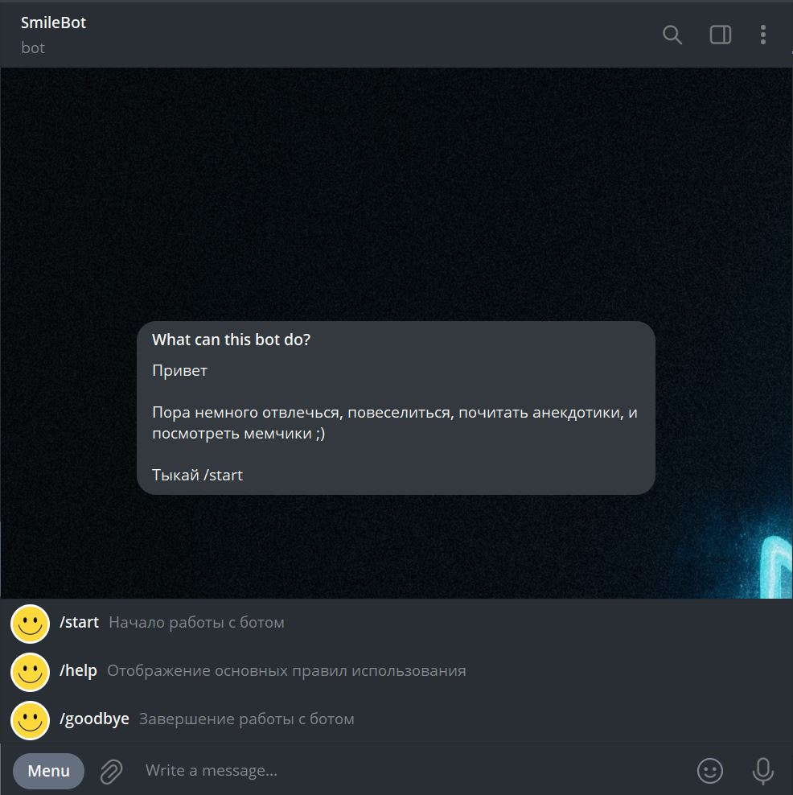

<a href="http://t.me/SmileGubchikBot" target="_blank"></a>
_Bot for jokes and memes_

### Demo

Click **<a href="http://t.me/SmileGubchikBot" target="_blank">here</a>** to open telegram SmileGubchikBot



### Project modules (requirements.txt)

<a href='https://pypi.org/project/aiogram'></a> <a href='https://pypi.org/project/asyncio'></a> <a href='https://pypi.org/project/beautifulsoup4'></a> <a href='https://pypi.org/project/lxml'></a> <a href='https://pypi.org/project/fake-useragent'></a> <a href='https://pypi.org/project/python-dotenv'></a> <a href='https://pypi.org/project/requests'></a> 

---

### Environment Variables

To run this project, you will need to add the following environment variables to your .env file

`BOT_TOKEN`

### Run Locally

Clone the project

```
  git clone https://github.com/Gubchik123/SmileGubchikBot.git
```

Go to the project directory

```
  cd SmileGubchikBot
```

Install dependencies

```
  pip install -r requirements.txt
```

Run the bot

```
  python bot/bot.py
```

> **Note:** Don't forget about environment variables
